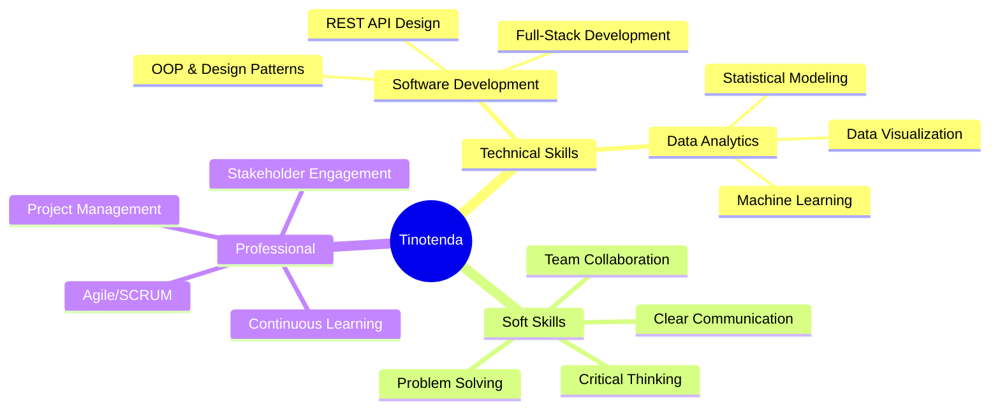

<div align="center">
  
</div>

<div align="center">
  
  ### 👨‍💻 Software Developer | 📊 Data Analyst | 🎓 Computer Science Graduate
  
  <p>
    <em>Transforming complex data into actionable insights & building scalable software solutions</em>
  </p>
  
  [](https://linkedin.com/in/tinogozho)
  [](mailto:tinogozho2@gmail.com)
  [](#)
  
</div>

---

## 🚀 About Me

```typescript
const tinotenda = {
    location: "Johannesburg, South Africa 🇿🇦",
    education: "BSc Computer Science - University of the Witwatersrand",
    currentRole: "Junior Software Developer @ IAT Fusion",
    passions: ["Software Architecture", "Data Science", "AI/ML", "Cloud Computing"],
    languages: ["English", "Shona", "IsiZulu"],
    availability: "Open to full-time opportunities from December 2025"
};
```

🎯 Results-driven developer with expertise in building production-grade applications using **C#/.NET**, **React**, **Python**, and **SQL Server**. Strong foundation in **data analysis**, **machine learning**, and **statistical modeling**. Passionate about leveraging technology and data-driven decision making for business innovation.

---

## 💼 Professional Experience

**Junior Software Developer** @ IAT Fusion | *Aug 2025 - Nov 2025*
- 🏗️ Designed and developed multiple production-grade full-stack applications
- 🔐 Architected RESTful APIs with secure authentication and optimized database queries
- 📊 Analyzed application metrics to identify bottlenecks and drive performance improvements
- 🤝 Collaborated within Agile SCRUM teams to deliver business-aligned solutions

---

## 🛠️ Tech Stack

<div align="center">

### Programming Languages


### Frontend Development


### Backend Development


### Data Science & ML


### Databases


### DevOps & Cloud


</div>

---

## 🌟 Featured Projects

<div align="center">

### 🛒 ThriftFinder (The Box)
**Enterprise E-Commerce Platform**

[](https://github.com/tino-ryan)
[](https://github.com/tino-ryan)
[](https://github.com/tino-ryan)

Campus marketplace with real-time messaging, analytics dashboard featuring sales metrics and customer insights, geolocation-based store discovery, and gamified rewards system.

---

### ⚽ Matchday
**Sports Facility Booking Platform**

[](https://github.com/tino-ryan)
[](https://github.com/tino-ryan)
[](https://github.com/tino-ryan)

Full-stack booking system with secure authentication, payment integration, and admin analytics dashboard providing booking insights and revenue reports. Deployed on Microsoft Azure.

---

### 🍽️ Restaurant Staff Dashboard
**Enterprise Management System**

[](https://github.com/tino-ryan)
[](https://github.com/tino-ryan)
[](https://github.com/tino-ryan)

Cloud-based platform with live order tracking, inventory management with automated alerts, shift scheduling, and real-time notifications.

---

### 🌍 GeoFinder
**Interactive Data Visualization**

[](https://github.com/tino-ryan)
[](https://github.com/tino-ryan)

Dynamic country explorer with advanced filtering, interactive map visualizations, and demographic statistics using REST Countries API.

</div>

---

## 📊 GitHub Statistics

<div align="center">
  
  
</div>

<div align="center">
  
  
</div>

---

## 🏆 Core Competencies

<div align="center">



</div>

---

## 📈 Weekly Development Breakdown

```text
React        12 hrs 30 mins  ████████████░░░░░░░░  45%
C#/.NET       8 hrs 15 mins  ██████████░░░░░░░░░░  30%
Python        4 hrs 20 mins  █████░░░░░░░░░░░░░░░  15%
SQL           2 hrs 10 mins  ██░░░░░░░░░░░░░░░░░░   8%
Other         0 hrs 35 mins  ░░░░░░░░░░░░░░░░░░░░   2%
```

---

## 🎯 Current Focus

- 🔭 Building enterprise-level applications with .NET and React
- 🌱 Deepening expertise in cloud architecture with Azure
- 👯 Open to collaborating on open-source projects
- 💡 Exploring AI/ML applications in real-world scenarios
- 📚 Continuous learning in software architecture and design patterns

---

## 📫 Let's Connect!

<div align="center">
  
I'm always interested in discussing technology, data science, and potential collaborations!

[](https://linkedin.com/in/tinogozho)
[](mailto:tinogozho2@gmail.com)

**💼 Available for full-time opportunities from December 2025**

</div>

---

<div align="center">
  
  
  
  
  <sub>💙 Crafted with passion | ⚡ Powered by innovation</sub>
</div>
